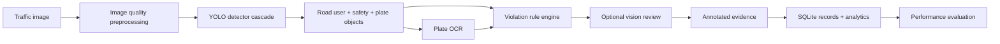

# Project Proposal: Gridlock AI Enforcer

## Problem

Manual traffic image inspection is slow, inconsistent, and difficult to scale across high-volume surveillance networks. A practical system must not only detect violations, but also produce reviewable evidence, searchable records, and measurable accuracy.

## Proposed Solution

Gridlock AI Enforcer is a computer-vision pipeline that analyzes traffic photos and produces structured violation evidence. The system combines object detection, specialist safety-equipment detection, plate OCR, road-rule reasoning, optional multimodal review, and a dashboard for analytics.

## Innovation

- Evidence-first design: every violation is tied to a bounding box, confidence, evidence source, and timestamp.
- Specialist classes for difficult violations: helmets, seatbelts, plates, stop lines, and traffic lights are model targets rather than vague scene descriptions.
- Camera calibration: stop-line and wrong-side rules use configurable camera geometry.
- Optional vision-model adjudication: a VLM can help with ambiguous images, but only high-confidence grounded results are accepted.
- Real evaluation workflow: the project reports Precision, Recall, F1-score, and mAP50 from labelled validation data.

## System Flow

## Expected Outcome

The system reduces manual review load by automatically producing violation candidates with evidence images and metadata. Human officers can search, filter, review, and export records instead of scanning raw camera images manually.

## Accuracy Plan

1. Build a labelled dataset covering day, night, rain, blur, dense traffic, and camera angles.
2. Fine-tune YOLO on traffic-specific and safety-specific classes.
3. Validate with mAP50 for boxes and Precision/Recall/F1 for final violation classes.
4. Inspect false positives through stored evidence and add hard negatives.
5. Calibrate stop-line and wrong-side rules per camera.

## Deployment Plan

- Prototype: FastAPI + React dashboard on a local machine.
- Pilot: GPU server or edge device with exported ONNX/TensorRT model.
- Production: camera-specific calibration, active learning review queue, and periodic retraining.
